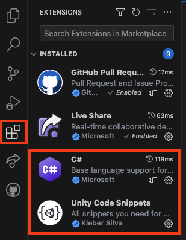

## الوحدة و شفرة الاستوديو المرئي

الوحدة تستخدم لغة البرمجة C# التي يستخدمها مطورو البرمجيات المحترفون. لكتابة التعليمات البرمجية للوحدة، ستحتاج إلى إضافة محرر كود خارجي.

يمكن استخدام العديد من محرري التعليمات البرمجية المختلفين، وتوصي وحدة الوحدة النسخة المجتمعية الكاملة من Visual Studio، ولكن هذا يتطلب حساب آخر.

بدلاً من ذلك، نوصي بـ [Visual Studio Code](https://code.visualstudio.com/)، وهو محرر تعليمات برمجية مجاني خفيف الوزن من Microsoft يمكنك استخدامه لكتابة التعليمات البرمجية بأي لغة تقريبًا، بما في ذلك C# مع Unity.

تنزيل وتثبيت [Visual Studio Code ](https://code.visualstudio.com/) لنظام التشغيل الخاص بك.

عندما تثبت محرر الاستوديو المرئي، يمكنك إضافة لوظائف باستعمال الملحقات.

أما الاثنان اللذان نوصي بهما فهما:
1. C# من عند مايكروسوفت، هذا سوف يعطي اكتمال الشفرة للغة C#
2. **مقتطفات رمز الوحدة** من كليبر سيلفا - ستمنحك إكمالات محددة للوحدة

يمكنك العثور على هذه عن طريق فتح قائمة الملحقات هي الشريط الجانبي الأيسر (المحدد أعلاه) وكتابة الأسماء في شريط البحث في الأعلى, يمكنك بعد ذلك النقر على الملحق ثم انقر فوق الزر الأزرق **تثبيت** تحت الاسم.

قم بتثبيت الملحقين الموصى بهما، كتلة كتل الكود C# وكتلة الكود البرمجي.

فتح الوحدة. انقر على تحرير ثم اختار التفضيلات من انقر على تحرير ثم اختار التفضيلات من القائمة.

في القائمة على اليسار، حدد **الأدوات الخارجية** وفي القائمة المنسدلة ل **محرر النص الخارجي** اختر **Studio Code**.

مزيد من المعلومات:
+ [Unity tutorial: Set your default script editor](https://learn.unity.com/tutorial/set-your-default-script-editor-ide){:target="_blank"}