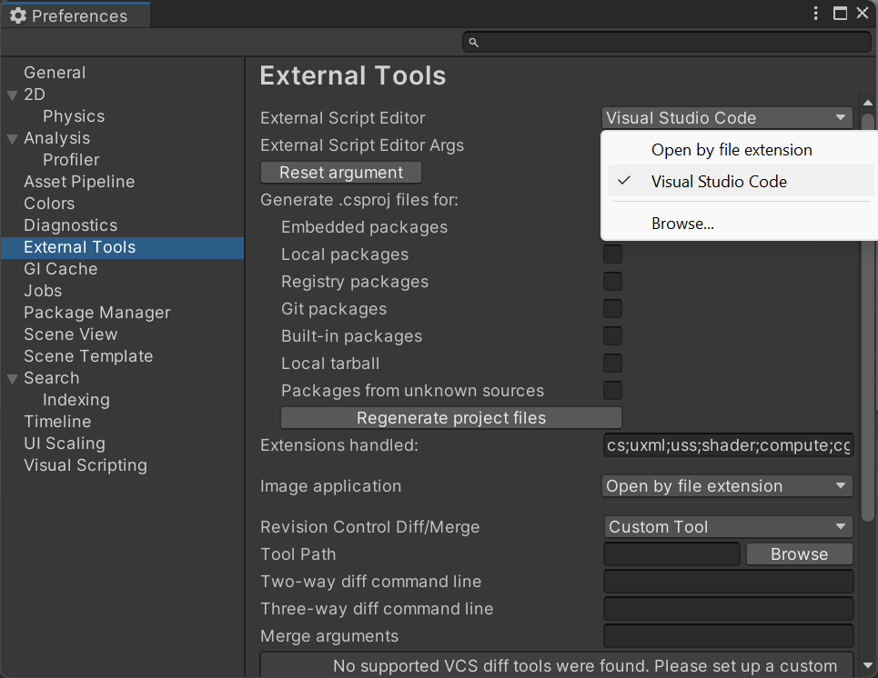

## Unity y Visual Studio Code

Unity usa el lenguaje de programación C#, que usan programadores profesionales. Para escribir códigos para Unity, vas a necesitar añadir un editor de códigos externo.

Se puede utilizar distintos editores de código y Unity recomienda la edición completa de la Comunidad de Visual Studio, sin embargo, esto requiere de otra cuenta.

En lugar ello, recomendamos [Visual Studio Code](https://code.visualstudio.com/), un editor de códigos ligero de Microsoft que puedes usar para escribir códigos en casi cualquier lenguaje de programación, incluso C# con Unity.

Descarga e instala [Visual Studio Code](https://code.visualstudio.com/) para tu sistema operativo.

Una vez que instales el editor de código Visual Studio, puedes agregar funciones usando **Extensiones**.

Las dos que recomendamos son:
1. **C#** de Microsoft, la cual te ofrece la terminación del código del lenguaje de programación C#
2. **Unity Code Snippets** de Kleber Silva, la cual te ofrece terminaciones específicas para Unity

Puedes encontrarlos abriendo el menú de extensiones en el panel lateral (resaltado arriba) y escribiendo los nombres en la barra de búsqueda en la parte superior, luego puedes hacer clic en la extensión y en el botón azul **Instalar** debajo del nombre.

Instala las dos extensiones recomendadas: C# y Unity Code Snippets.

Abre Unity. Haz clic en **Editar** y luego elige **Preferencias** en el menú.

En el menú de la izquierda, selecciona **Herramientas Externas** y en el menú desplegable de **Editor Externo de Script** elige **Visual Studio Code**.

Información adicional:
+ [Unity tutorial: Set your default script editor](https://learn.unity.com/tutorial/set-your-default-script-editor-ide){:target="_blank"}