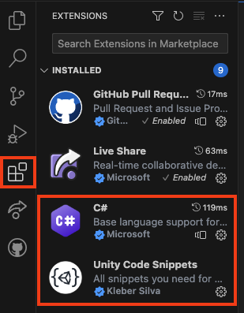

## Unity et Visual Studio Code

Unity utilise le langage de programmation C# qui est utilisé par les développeurs de logiciels professionnels. Pour écrire du code pour Unity, tu devras ajouter un éditeur de code externe.

De nombreux éditeurs de code différents peuvent être utilisés, et Unity recommande l'édition Visual Studio Community, qui nécessite toutefois un autre compte.

Nous te recommandons plutôt [Visual Studio Code](https://code.visualstudio.com/), un éditeur de code léger et gratuit de Microsoft que tu peux utiliser pour écrire du code dans presque tous les langages, y compris C# avec Unity.

--- task ---

Télécharge et installe [Visual Studio Code](https://code.visualstudio.com/) pour ton système d'exploitation.

--- /task ---

Une fois que tu as installé l'éditeur de code Visual Studio, tu peux ajouter des fonctionnalités à l'aide des **Extensions**.

Les deux que nous recommandons sont :
1. **C#** de Microsoft : cela te permet de compléter le code pour le langage C#
2. **Unity Code Snippets** de Kleber Silva : il te donnera des compléments spécifiques pour Unity

Tu peux les trouver en ouvrant le menu des extensions dans la barre latérale de gauche (surlignée ci-dessus) et en tapant les noms dans la barre de recherche en haut, tu peux ensuite cliquer sur l'extension et sur le bouton bleu **Install** sous le nom.

--- task ---

Installe les deux extensions recommandées, C# et Unity Code Snippets.

--- /task ---

--- task --- 

Ouvre Unity. Clique sur **Edit** puis choisis **Preferences** dans le menu.

Dans le menu de gauche, sélectionne **External Tools** et dans le menu déroulant de **External Script Editor**, choisis **Visual Studio Code**.

--- /task ---

Informations complémentaires :
+ [Unity tutorial: Set your default script editor](https://learn.unity.com/tutorial/set-your-default-script-editor-ide){:target="_blank"}