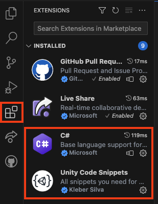

## Unity en Visual Studio-code

Unity gebruikt de programmeertaal C#, die wordt gebruikt door professionele software-ontwikkelaars. Om code te schrijven voor Unity moet je een externe code-editor toevoegen.

Er kunnen veel verschillende code-editors worden gebruikt en Unity raadt de volledige Community-editie van Visual Studio aan, maar hiervoor is een extra account vereist.

In plaats daarvan raden we [Visual Studio Code](https://code.visualstudio.com/) aan, een gratis code-editor van Microsoft die je kunt gebruiken om code te schrijven in bijna elke taal, inclusief C# met Unity.

--- task ---

Download en installeer [Visual Studio Code](https://code.visualstudio.com/) voor jouw besturingssysteem.

--- /task ---

Nadat je de Visual Studio-code-editor hebt geïnstalleerd, kun je functionaliteit toevoegen met behulp van **Extensions** (extensies of uitbreidingen).

De twee die wij aanbevelen zijn:
1. **C#** van Microsoft - dit geeft je code-aanvulling voor de C#-taal
2. **Unity Code Snippets** door Kleber Silva - geeft je specifieke aanvullingen voor Unity

Je kan deze vinden door het extensiemenu te openen in de linkerzijbalk (hierboven gemarkeerd) en de namen in de zoekbalk bovenaan te typen, je kunt vervolgens op de extensie klikken en op de blauwe knop **Installeer** onder de naam klikken.

--- task ---

Installeer de twee aanbevolen extensies, C# en Unity Code snippets.

--- /task ---

--- task --- 

Open Unity. Klik op **Edit** en kies vervolgens **Preferences** in het menu.

Selecteer in het menu aan de linkerkant **External Tools** en kies in het vervolgkeuzemenu voor **External Script Editor** **Visual Studio Code**.

--- /task ---

Meer informatie:
+ [Unity tutorial: Set your default script editor](https://learn.unity.com/tutorial/set-your-default-script-editor-ide){:target="_blank"}